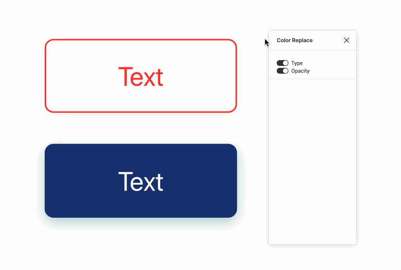

<p align="center">quick and easy replace color tool panel in Frame.</p>
<p align="center"></p>

<p align="center"></p>


## Installation
You can install it through the Figma App [here](https://www.figma.com/c/plugin/797668496099411237/Color-Replace)


## Usage
1. Open **Color Replace** from the plugin menu.
2. Select one or more frames.
3. Change the color on the tool panel.


## Development
```
Rollup
|- UI: Svelte + Sass
|- Main: Typescript
```

```npm run dev```
or
```npm run build```

### Link
https://www.figma.com/plugin-docs/api/api-reference

## License
[MIT](./LICENSE)
